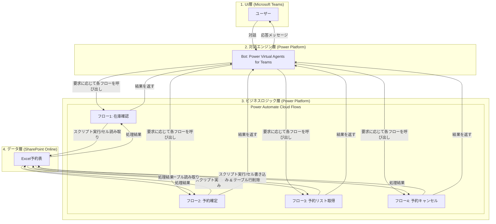

# デモ機予約管理Bot 設計書

**設計書バージョン:** 2.1
**バージョン名:** 正確なExcel構造対応 最終版
**更新日時:** 2025.09.03

## 1. システムアーキテクチャ

### 1.1. コンポーネント構成
本システムは下図の4つのコンポーネントで構成され、Microsoft 365ライセンスの範囲内で動作します。



### 1.2. データフロー（予約処理の例）
1.  **ユーザー**がTeams上でBotに「FEデモ機を9/30から10/2まで借りたい」と発話します。
2.  **Power Virtual Agents (PVA)**がトリガーフレーズを認識し、エンティティ抽出機能で「デモ機種類」「開始日」「終了日」を特定します。
3.  **PVA**は、抽出した情報を引数として**Power Automate フロー1 (在庫確認)**を呼び出します。
4.  **フロー1**は、**SharePoint上のExcelファイル**にアクセスし、`25年9月`と`25年10月`シートを横断して空き状況を確認します。
5.  **フロー1**は、予約可能なデモ機名（例: `FEデモ機2`）をPVAに返します。
6.  **PVA**はユーザーに「FEデモ機2が予約可能です。予約しますか？」と確認します。
7.  **ユーザー**が「はい」と応答します。
8.  **PVA**は、予約情報を引数として**Power Automate フロー2 (予約確定)**を呼び出します。
9.  **フロー2**は、**Excelファイル**の該当シート・セルに"C"を書き込み、`予約ログ`シートに行を追加します。
10. **フロー2**は、処理結果（成功）をPVAに返します。
11. **PVA**はユーザーに「予約が完了しました。」と最終メッセージを送信します。

---

## 2. データモデル設計 (Excel)

*   **ファイル場所**: 任意のSharePointサイトのドキュメントライブラリ
*   **ファイル名**: `デモ機予約管理表.xlsx`

### 2.1. カレンダーシート
*   **シート名**: `yy年M月`形式 (例: `25年9月`, `25年10月`)
*   **テーブル化**: **このシートは「テーブルとして書式設定」を使用しません。** Power Automateがセルの位置（行番号・列番号）を直接指定して読み書きを行います。
*   **構造**:
    *   **日付ヘッダー (8行目)**: **C8セル**から右に向かって、月の日を記載 (`1`, `2`, `3`...)。
    *   **デモ機名リスト (B列)**: **B9セル**から下に向かって、デモ機名を記載 (例: `B9`="FEデモ機1", `B10`="FEデモ機2"...)。
    *   **予約データ領域**: **C9セル**から右下の範囲。デモ機（行）と日付（列）が交差するセルに予約フラグ"C"等を格納します。

*   **レイアウト例**:

| | **列B** | **列C** | **列D** | **列E** |
| :--- |:---|:---|:---|:---|
| **行8** | (B8) | (C8) 1 | (D8) 2 | (E8) 3 |
| **行9** | (B9) FEデモ機1 | (C9) | (D9) | (E9) |
| **行10**| (B10) FEデモ機2 | (C10) | (D10) | (E10) |
| **行11**| (B11) FEデモ機3 | (C11) | (D11) | (E11) |

### 2.2. 予約ログシート
*   **このシートはPower Automateが扱いやすいよう、テーブル化します。**
*   **シート名**: `予約ログ`
*   **テーブル化の範囲**: A1セルから始まるデータ範囲全体をテーブルとして設定します。
*   **テーブル名**: `BookingLog`
*   **構造**:

| 列ヘッダ名 | データ型 | 説明 |
| :--- | :--- | :--- |
| **予約ID** | 文字列 | Power Automateで `guid()` 関数を使い生成する一意のID |
| **予約日時** | 文字列 | Power Automateで**日本時間(JST)に変換後**、`yyyy-MM-ddTHH:mm:ss`形式で記録 |
| **予約者名** | 文字列 | PVAから渡されるTeamsユーザーの表示名 |
| **デモ機名** | 文字列 | 予約が確定したデモ機の正式名称 |
| **予約開始日**| 日付 (yyyy-MM-dd)| 予約期間の開始日 |
| **予約終了日**| 日付 (yyyy-MM-dd)| 予約期間の終了日 |
| **ステータス** | 文字列 | "予約中" |

---

## 3. インターフェース設計 (Power Virtual Agents for Teams)

### 3.1. トピックとエンティティ

| トピック名 | トリガーフレーズ (例) | 概要 |
| :--- | :--- | :--- |
| **1. デモ機予約** | `予約したい`, `借りたい`, `デモ機`, `空いてる？` | ユーザーからデモ機の種類、期間を聞き出し、在庫確認と予約確定を行うメインフロー。 |
| **2. 予約キャンセル** | `キャンセルしたい`, `予約をやめる`, `取り消し` | 予約ログを提示し、ユーザーに選択させてキャンセル処理を依頼するフロー。 |
| **3. 挨拶** | `こんにちは`, `ありがとう` | 簡単な挨拶を返すシステム標準のトピック。 |

| エンティティ名 | 抽出対象 | 説明 |
| :--- | :--- | :--- |
| **デモ機種類** | `FEデモ機`, `RTデモ機`, `PC` | ユーザーの発話からデモ機の種類を特定する。（類義語リストで定義） |
| **日付** | `9/30`, `明日`, `来週の月曜日` | 日付を抽出する。（システム標準のエンティティを利用） |

### 3.2. 対話フロー設計（デモ機予約トピック）

1.  **トリガー**: トリガーフレーズでトピックを開始。
2.  **質問 (デモ機種類)**: 「どのデモ機を予約しますか？」と質問し、回答を`デモ機種類`エンティティで変数に格納。
3.  **質問 (開始日)**: 「いつから利用しますか？」と質問し、回答を`日付`エンティティで変数に格納。
4.  **質問 (終了日)**: 「いつまで利用しますか？」と質問し、回答を`日付`エンティティで変数に格納。
5.  **アクション (在庫確認)**: **Power Automate フロー1**を呼び出し、上記3つの変数を引数として渡す。
6.  **条件分岐**: フロー1の戻り値 `IsAvailable` が `true` かどうかで分岐。
    *   **Trueの場合**:
        1.  **メッセージ表示**: 「(戻り値 `AvailableDeviceName`) が予約可能です。予約しますか？」と表示。
        2.  **質問 (確認)**: 選択肢「はい」「いいえ」を提示。
        3.  **条件分岐**:
            *   **「はい」の場合**:
                1.  **アクション (予約確定)**: **Power Automate フロー2** を呼び出す。
                2.  **メッセージ表示**: 「予約が完了しました。」
            *   **「いいえ」の場合**:
                1.  **メッセージ表示**: 「操作を中断しました。」
    *   **Falseの場合**:
        1.  **メッセージ表示**: 「申し訳ありません。その期間、ご希望のデモ機はすべて予約で埋まっています。」
7.  **終了**: 対話を終了。

---

## 4. 処理ロジック設計 (Power Automate)

**重要：** カレンダーシートがテーブル化されておらず、ヘッダーが特殊な位置にあるため、**Office Scripts** を利用してExcel内のデータを効率的に操作します。これにより、Power Automate側での複雑なループ処理を回避し、高速かつ安定した動作を実現します。

### 4.0. 日時処理の基本方針
**本システムにおける全ての日時処理は、日本標準時 (JST, UTC+9) を基準とします。**

*   **JST現在時刻取得のための式:**
    ```
    convertTimeZone(utcNow(), 'UTC', 'Tokyo Standard Time')
    ```

### 4.1. フロー1: 在庫確認 (CheckAvailability)
*   **トリガー**: Power Virtual Agents
*   **入力**: `deviceType` (文字列), `startDate` (文字列), `endDate` (文字列)
*   **処理概要**:
    1.  **Office Scriptの実行** アクションを使用します。このスクリプトは以下の処理を行います。
        *   **入力**: `deviceType`, `startDate`, `endDate`
        *   **処理**:
            1.  `startDate`と`endDate`から対象のシート（複数月対応）を特定する。
            2.  各対象シートで、**B列の9行目以降**を検索し、名前に `deviceType` が含まれるデモ機のリスト（デモ機名と行番号）を作成する。
            3.  リストアップしたデモ機ごとに行をチェックする。
            4.  `startDate`から`endDate`までの日付（**8行目の値**）に対応する列番号（C列=3, D列=4...）を計算する。
            5.  指定された期間のセル（**9行目以降**のデータ領域）が全て空白かを確認する。
            6.  最初に空きが見つかったデモ機の名前を返す。見つからなければ空文字を返す。
        *   **出力**: `availableDeviceName` (文字列)
    2.  スクリプトの出力 `availableDeviceName` が空かどうかで、`isAvailable`（ブール値）を判断する。
*   **出力**: `isAvailable` (ブール値), `availableDeviceName` (文字列), `errorMessage` (文字列)

### 4.2. フロー2: 予約確定 (ConfirmBooking)
*   **トリガー**: Power Virtual Agents
*   **入力**: `userName` (文字列), `deviceName` (文字列), `startDate` (文字列), `endDate` (文字列)
*   **処理概要**:
    1.  Excelの「**表に行を追加**」アクションで、`予約ログ`シートの`BookingLog`テーブルに情報を書き込む。`予約日時`列にはJST変換後の時刻を記録する。
    2.  **Office Scriptの実行** アクションを使用します。このスクリプトは以下の処理を行います。
        *   **入力**: `deviceName`, `startDate`, `endDate`
        *   **処理**:
            1.  `startDate`と`endDate`から対象のシートを特定する。
            2.  各対象シートで、**B列の9行目以降**を検索し、`deviceName`と完全に一致するデモ機の行番号を見つける。
            3.  `startDate`から`endDate`までの日付（**8行目の値**）に対応する列番号を計算する。
            4.  特定した行・列のセルに "C" を書き込む。
*   **出力**: `isSuccess` (ブール値), `errorMessage` (文字列)

### 4.3. フロー3: 予約リスト取得 (GetBookings)
*   **トリガー**: Power Virtual Agents
*   **処理概要**:
    1.  Excelの「**表内に存在する行を一覧表示**」で、`予約ログ`シートの`BookingLog`テーブルデータを全て取得。
    2.  「データ操作 - フィルター配列」で、`予約開始日` が `formatDateTime(convertTimeZone(utcNow(), 'UTC', 'Tokyo Standard Time'), 'yyyy-MM-dd')` (今日のJST日付) 以上のデータのみを抽出する。
    3.  「データ操作 - 選択」アクションで、PVAに表示するための文字列配列を生成。
*   **出力**: `bookingList` (文字列配列), `bookingData` (オブジェクト配列)

### 4.4. フロー4: 予約キャンセル (CancelBooking)
*   **トリガー**: Power Virtual Agents
*   **入力**: `bookingId` (文字列)
*   **処理概要**:
    1.  `予約ログ`シートの`BookingLog`テーブルから、`bookingId`が一致する行を特定し、その行の `deviceName`, `startDate`, `endDate` を取得。
    2.  Excelの「**行の削除**」アクションで、`予約ログ`シートの該当行を削除する。
    3.  **Office Scriptの実行** アクションを使用します。
        *   **入力**: `deviceName`, `startDate`, `endDate`
        *   **処理**:
            1.  カレンダーシートの該当期間のセルを検索し（フロー2と同様のロジック）、値を空白にする。
*   **出力**: `isSuccess` (ブール値), `errorMessage` (文字列)

---

## 5. エラーハンドリング
*   各Power Automateフローの主要なアクション（特にOffice Script実行）には、「実行後」の設定で「失敗した場合」の分岐を追加する。
*   エラー発生時は、エラー詳細をログとして記録（管理者へのメール通知など）し、PVAには汎用的なエラーメッセージ（例: "処理中にエラーが発生しました"）を返す。
*   PVA側では、フローからエラーメッセージが返された場合、「システムエラーが発生しました。管理者にご連絡ください。」といったメッセージをユーザーに表示する。

```
